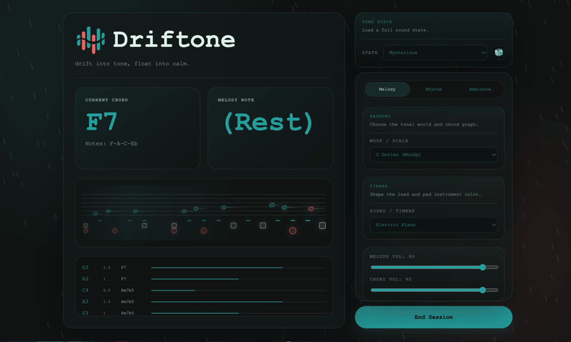

<h1 align="center">
   Driftone
</h1>

<p align="center"><strong>Drift into Tone, Float into Calm.</strong></p>

<p align="center">
  <a href="https://banana889.github.io/Driftone/"></a>
  
  
  
</p>

> Based on Tone.js, ~~LLM~~, and our poor music theory...

Driftone is a browser-based experiment in generative ambient music.
It combines simple harmony rules, evolving melody logic, selectable instruments, and environmental noise to create an endless soundscape.

If you often find yourself distracted by picking a playlist before getting to work, or if the music platforms keep recommending songs that don't quite fit your focus vibe, give this little relaxing website a try. 💙



## Run

Try it online on my [GitHub Pages site](https://banana889.github.io/Driftone/).

For development:

```bash
npm install
npm run dev
```

For production verification:

```bash
npm run build
npm test
```

## Mobile App

Driftone ships an Android app shell through Capacitor.
Sync the latest web build into the Android project:

```bash
npm run cap:sync
```

We have also prepared the downloadable debug APK in [release](https://github.com/Banana889/Driftone/releases) through Github Actions.

## Architecture

The main app has migrated to Vite, React, TypeScript, SCSS, and npm-local Tone.js.

See [docs/migration.md](./docs/migration.md) for migration details.

## Roadmap

See [docs/TODO.md](./docs/TODO.md).

If you enjoy Driftone, consider giving this repo a star.


## Acknowledgements

- Special thanks to [LINUX.DO](https://linux.do/) for providing a promotion platform.