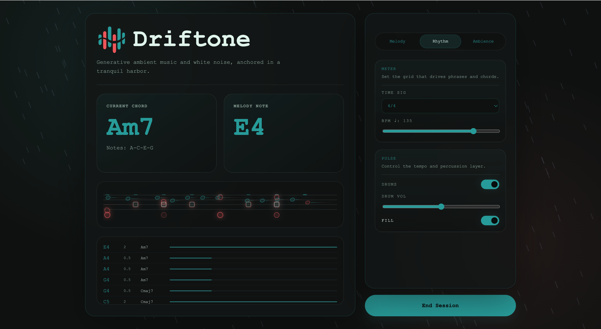

<h1 align="center">
   Driftone
</h1>

<p align="center"><strong>Generative ambient music and white noise, anchored in a tranquil harbor.</strong></p>

<p align="center">
  <a href="https://banana889.github.io/Driftone/"></a>
  
  
  
</p>

> Based on Tone.js, ~~Gemini~~, and my poor music theory...
>
> Developing...

Driftone is a browser-based experiment in generative ambient music.
It combines simple harmony rules, evolving melody logic, selectable instruments, and environmental noise to create an endless soundscape.



## Run

Try it online on my [Github Page](https://banana889.github.io/Driftone/).

Or serve the project over a local HTTP server:

```bash
python -m http.server 8000
```

Then open:

- `http://localhost:8000/`
- `http://localhost:8000/demo.html`
- `http://localhost:8000/demo2_with_chords.html`

Running it directly via `file://` is not recommended.
The app uses a Web Worker (`js/worker.js`) and audio assets such as `res/rain.mp3`, which browsers often restrict outside a local server context.

## Roadmap

See it at [here](./TODO.md).

If you enjoy Driftone, consider giving this repo a star.
